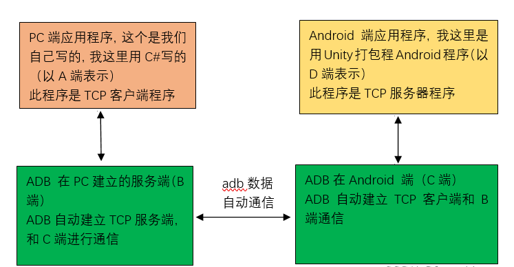

### 编译注意事项：

#### exe编译

按照官网正常用VS打开sln工程Build就好了

#### apk编译

需要先下载MSYS2或MinGW，在对应的Shell中安装以下依赖库：

```shell
mingw-w64-x86_64-cmake 3.17.3-1
mingw-w64-x86_64-gcc 10.2.0-1
mingw-w64-x86_64-make 4.3-1
```

MinGW安装教程：

https://people.eng.unimelb.edu.au/ammoffat/teaching/20005/Install-MinGW.pdf

环境部署相关命令：

```
pacman -Q -e				查看已经安装的库
pacman -S <packagename>		安装对应的包
```

编译APK步骤：

```shell
mkdir build-android(64)
cd build-android
cmake -DBUILD_ANDROID=On -DANDROID_ABI=armeabi-v7a -G "MinGW Makefiles" ..		构建生成文件32位
cmake -DBUILD_ANDROID=On -DANDROID_ABI=arm64-v8a -G "MinGW Makefiles" ..		构建生成文件64位
mingw32-make -j8											生成APK
```


### 工具及命令行补充：

IDA远程调试Android SO流程：

```shell
adb shell am start -D -n <package_name>/com.unity3d.player.UnityPlayerActivity
```

ADB常用命令行：

```shell
# 查看Android手机SDK版本
adb shell getprop ro.build.version.sdk

# 查看Android手机所有配置设置
adb shell getprop

# 关闭正在运行的Activity
adb shell am force-stop <package_name>

# 移除存在Socket端口监听--
adb forward --remove tcp:xxx
# 查看所有的转发连接
adb forward --list
# adb建立数据转发相关命令
adb forward <local> <remote> tcp:<port>
                             localabstract:<unix domain socket name>
                             localreserved:<unix domain socket name>
                             localfilesystem:<unix domain socket name>
                             dev:<character device name>
                             jdwp:<process pid> (remote only)
                             
# 例如：创建一个转发，将PC端B端口收到的数据转发给手机上的C端口
adb forward tcp:PortB tcp:PortC
# 要建立连接还需要
（a）在手机端，建立一个端口为PortC的server，并打开server到监听状态。
（b）在PC端，建立一个socket client端，连接到端口为PortB的server上。
（c）adb forward会建立一个转发服务
```



jdwp Hook流程


```shell
#启用图层
adb shell settings put global enable_gpu_debug_layers 1
#指定待抓帧的目标应用
adb shell settings put global gpu_debug_app <package_name>
#指定搜索图层的应用
adb shell settings put global gpu_debug_layer_app <package_name>
#指定GLES图层的名称
adb shell settings put global gpu_debug_layers_gles libVkLayer_GLES_RenderDoc.so
#指定Vulkan图层的名称
adb shell settings put global gpu_debug_layers VK_LAYER_RENDERDOC_Capture
#查看全局设置
adb shell settings list global
#启动待抓帧的目标应用
adb shell am start -S -n <package_name>/<activity_name>
```


### 源码整理

#### C&R主体功能

##### CaptureContext.cpp（Capture及Replay功能相关逻辑代码）

LoadCapture：加载RDC文件

##### ReplayManager.cpp（Replay功能管理器）

DisconnectFromRemoteServer：断开远端设备连接

CurrentRemote：获取当前连接设备（RemoteHost）

**ExecuteAndInject**：启动Activity并注入（点击Launch后很重要的一步）


#### 界面相关

##### MainWindow.cpp（GUI主界面功能入口）

setRemoteHost：选择远端设备（RemoteHost）

OnCaptureTrigger：点击Launch连接Activity，对于非Inject模式触发该函数

OnInjectTrigger：点击Launch连接Activity，对于Inject模式触发该函数


##### VirtualFileDialog.cpp

手机Active窗口主要逻辑

##### CaptureDialog.cpp（Capture界面）

on_exePathBrowse_clicked：点击选择Debug的应用按钮

TriggerCapture：选择调试的Activity之后点击“Launch”按钮

IsInjectMode：判断是否是Inject模式

两个重要委托函数，初始化是在CaptureContext:GetCaptureDialog中

m_CaptureCallback：Launch时，非Inject模式触发，对应MainWindow的OnCaptureTrigger

m_InjectCallback：Launch时，Inject模式触发，对应MinWindow的OnInjectTrigger

CheckAndroidSetup：检查Android打包设置（RENDERDOC_CheckAndroidPackage）

#### 其他核心脚本

##### core.cpp

###### RenderDoc（RenderDoc单例类）

m_Protocols （map）：存放设备Protocol的字典

RegisterDeviceProtocol：注册设备Protocol

GetDeviceProtocol：获取设备Protocol

----so----

RegisterMemoryRegion


##### android.cpp

###### AndroidController(IDeviceProtocolHandler)

GetDevices：adb获取设备列表

StartRemoteServer：启动远端服务（renderdoc apk）

###### AndroidRemoteServer(安卓远端服务器)

ExecuteAndInject：启动并注入

LazilyStartLogcatThread：判断LogcatProcess是否运行

GetJdwpPort：生成jdwp端口号，35900依次+1

OpenCapture：打开RDC文件


SupportsNativeLayers：Version Check

ResetCaptureSettings：重置抓屏设置


##### android_utils.cpp

GetSupportedABIs：获得设备支持的系统架构（ABI）

GetFolderName：获取Android设备目录


##### remote_server.cpp

###### RemoteServer(Socket远程通信)

Connected：检查与远端服务器的Socket连接是否在

Ping：Ping设备Server


##### target_control.cpp

TriggerCapture：点击Capture后，创建RDC序列化写入流

ReceiveMessage：记录Capture信息

RENDERDOC_CreateTargetControl：创建Socket链接，Launch的时候触发


##### LiveCapture.cpp

connectionThreadEntry：客户端Socket线程监听入口


##### jdwp.cpp

InjectWithJDWP：注入


##### serialiser.cpp

序列化读写通用工具类


##### gl_driver.cpp

Android端OpenGL平台截帧及Replay核心类WrappedOpenGL

BuildGLExtensions：初始化构建GL扩展接口

BuildGLESExtensions：初始化构建GLES扩展接口


##### gl_driver.h

定义了一些OpenGL对象ShaderData、ProgramData、PipelineData、TextureData

定义了一系列Hook的序列化函数接口，具体实现在gl/Function Wrappers中，具体调用在WrappedOpenGL::ProcessChunk


##### gl_replay.cpp

CreateReplayDevice：创建


#### Android APK代码


### RenderDoc主要流程描述

#### 连接远端设备

主要是启动Android手机的renderdoccmd.apk作为远端的Server，目标设备没有安装rdccmd，则通过adb安装apk，之后根据系统支持的架构启动对应的rdc server

#### 启动注入测试apk

通过JDWP连接对应

